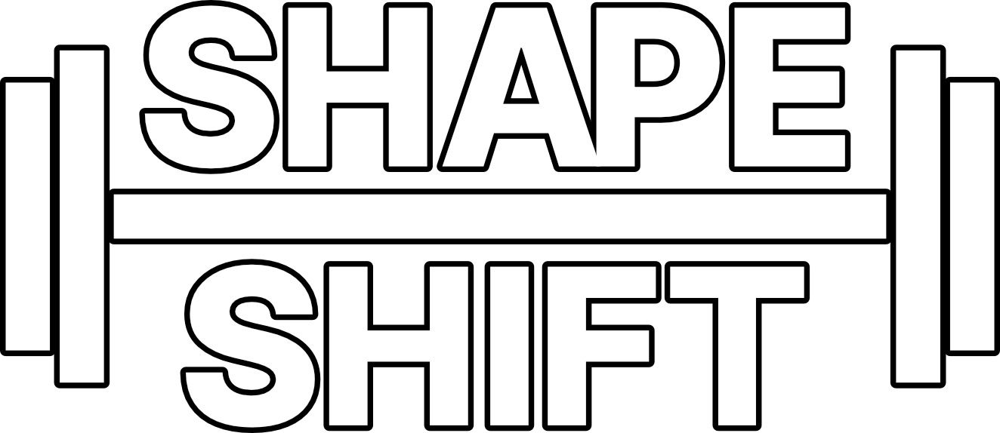

<div>
<div align="center">
</div>

---
## /frontend 
* React.js Web Application
---
## /api
* Express API

## How to Run Development Locally
### Installation
```sh
# install the JS deps
npm install --prefix ./api
npm install --prefix ./frontend
```
### Configuration & Initialization
Under `api/.env` you can control what MongoDB instance to connect to. 
If you are using your own MongoDB, then you will need to set up the database like so
```sh
npm run create --prefix ./api # this will throw an error if the database is already built
```
If you need to destroy the database for whatever reason `npm run delete --prefix ./api` will delete everything, and
running `npm run refresh --prefix api` will destroy the database and rebuild everything in one go.
### Run the website
```sh
# now open two terminals
# in the first one
npm run start --prefix ./api # start the API
# in the second one
npm run start --prefix ./frontend
# frontend .env should have the entry 'REACT_APP_API_URL="http://localhost:3001/api"'
```

## How to Build & Run Docker Container
```sh
# building
chmod +x ./build.sh
./build.sh

# running
docker run -it -p 80:80 --rm shapeshift:latest
```
The server will be running on port 80, visit http://localhost in your browser.